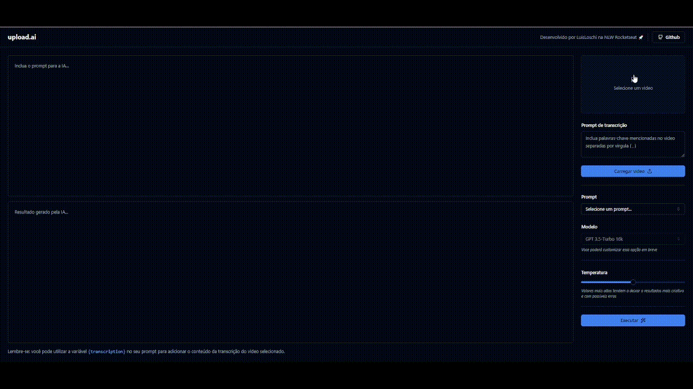

<h1 align= "center" font-size="30px"> 
    IA generativa para criação de títulos e descrições de vídeos
</h1>

<h3 align= "center">
    NLW IA | Trilha Mastery
</h3>

<br>

 # 🎬 Demonstração

<div align= "center">
    
</div>

<br>

# 💻 Projeto
Aplicação que possibilita realizar upload de videos e por meio de IA, criar automaticamente títulos chamativos e descrições com um boa indexação.

<br>

# 📚 Tecnologias
- React
- Tailwind
- shadcn/ui
- Node.js
- Fastify
- SQLite
- Prisma
- API da OpenAI
- Whisper-1
- GPT-3.5-turbo


<br>

# 🚀 Executar projeto
Antes de começar, você vai precisar ter instalado em sua máquina as seguintes ferramentas: Git, Node.js. 

Para executar o Front-End localmente:

```
# Clone este repositório
$ git clone https://github.com/LuisLoschi/upload-ia.git

# Acesse a pasta do projeto no terminal/cmd
$ cd upload-ai-web

# Instale as dependências do projeto
$ npm install 

# Execute a aplicação
$ npm run dev
```

A aplicação inciará na porta: 5173 - http://localhost:5173.

Para executar o Back-End localmente:
```
# Acesse a pasta do projeto no terminal/cmd
$ cd api

# Instale as dependências do projeto
$ npm install 

# Execute a aplicação
$ npm run dev
```

A aplicação inciará na porta: 5174

---